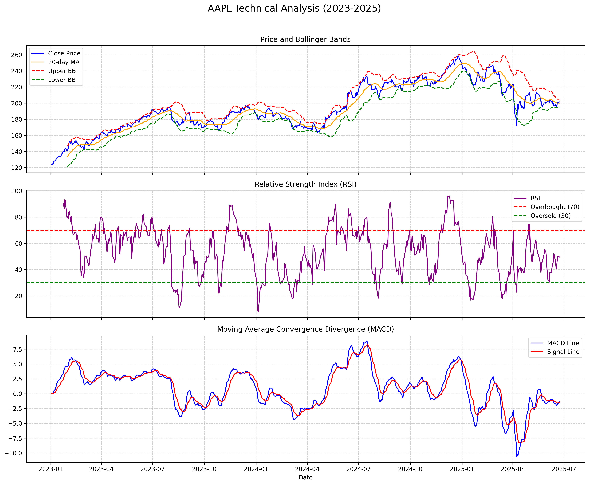
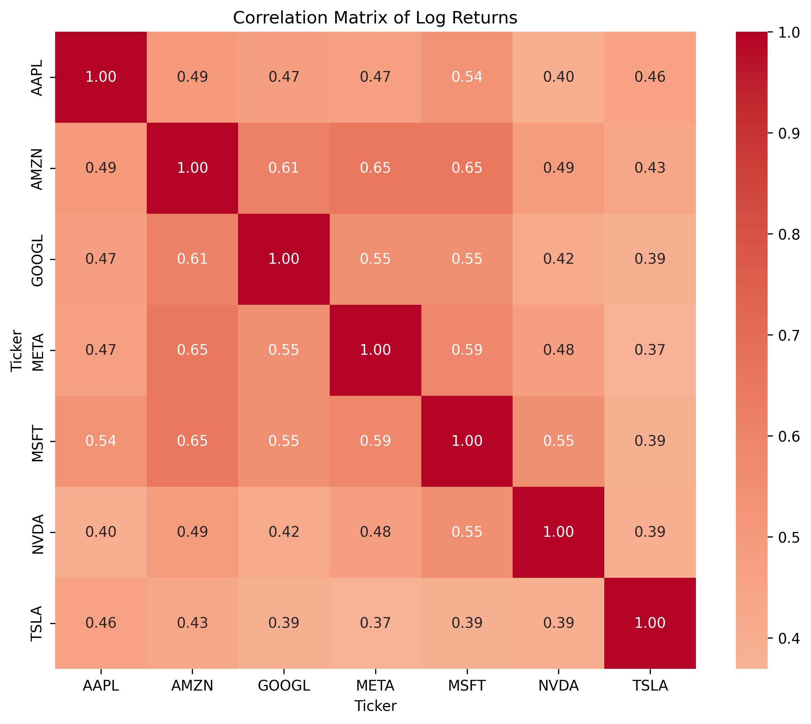

# Financial Data Analysis and Technical Indicators

This project provides a comprehensive Python script for downloading financial data of popular stocks, performing basic statistical analyses, and visualizing various technical analysis indicators (Bollinger Bands, RSI, MACD). The analysis results are neatly organized and saved as image files in separate folders.

## Project Purpose

This script automates the following analyses to help understand the performance and potential buy/sell signals of financial assets:

* **Stock Data Retrieval:** Downloads historical closing prices for specified stock tickers within a given date range.
* **Basic Statistics:** Calculates fundamental statistics for log returns, including mean, standard deviation, skewness, and kurtosis.
* **Annualized Volatility:** Visualizes the annualized volatility of the stocks, aiding in the comparison of risk levels.
* **Correlation Matrix:** Displays the correlation between the log returns of stocks, revealing how assets move in relation to each other.
* **Technical Indicators:**
    * **Bollinger Bands (BB):** Illustrates the volatility of the price around its average and identifies potential overbought/oversold regions.
    * **Relative Strength Index (RSI):** Determines whether an asset is overbought or oversold.
    * **Moving Average Convergence Divergence (MACD):** Shows the trend's direction, strength, momentum, and potential reversal points.

All charts are saved in PNG format, making them easy to review and share.

## Requirements

To run this script, the following Python libraries must be installed:

* `yfinance`
* `pandas`
* `matplotlib`
* `numpy`
* `seaborn`

You can install these libraries using the following command in your terminal:

pip install yfinance pandas matplotlib numpy seaborn

Note: You might need to use pip3 instead of pip if you have multiple Python versions installed.

## Usage

Clone or Download the Project:
Download the script file to your computer or clone it from a Git repository.

Run the Code:
Navigate to the directory containing the script file in your terminal or command prompt and execute the following command:

python main.py

(Replace main.py with the actual name of your script file if you saved it differently.)

## Configuration

Ticker List: You can specify the stocks to be analyzed within the tickers list:

tickers = ['AAPL', 'MSFT', 'GOOGL', 'AMZN', 'META', 'NVDA', 'TSLA']

Feel free to update this list with any stock symbols you wish to analyze.

Date Range: The data retrieval date range can be modified by updating the start_date and end_date variables.

start_date = '2023-01-01'
end_date = '2025-06-24'

## Outputs

Upon successful execution of the script, two new folders will be created in the directory where the script was run:

technical_analysis_charts/: This folder will contain PNG files of the Bollinger Bands, RSI, and MACD charts for each ticker in your tickers list. Each file will be named using the respective ticker symbol (e.g., AAPL_technical_analysis.png).

general_portfolio_charts/: This folder will contain two charts related to the general portfolio analysis:

annualized_volatility_bar_chart.png: A bar chart illustrating annualized volatility.

correlation_matrix_heatmap.png: A heatmap showing the correlation matrix of log returns.

Additionally, the basic statistics of log returns will be printed to the terminal.

## Example Outputs (Visualizations)

**Example Image 1: Apple (AAPL) Technical Analysis**

**Example Image 2: Annualized Volatility**
  

**Example Image 3: Correlation Matrix**

## Contributing
Contributions and bug fixes are welcome! If you'd like to contribute, please send a pull request or open an issue.